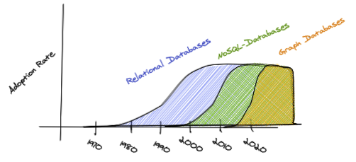

# 

**Abstract:** Chapter 1, revolves around the concept of *graph thinking*: What it is, what context it came from and finally the future of it. Graph thinking is essentially the idea of being able to analyze whether a problem is solvable with graph-theory. This sounds like a banal point, but my interpretation of the point that the authors are trying to make, is that this the practitioner also needs to have a intuition for when it is usable. However, because most Systems Architects and more recently Data Engineers are accustomed to thinking mainly in relational-structures and data-bases, they often miss the obvious places where a graph database would excel instead.

**Early adopters and broader acceptance**
Just like the relational-structures had early adopters before the larger part of the community adopted the practice, likewise the graph-architecture is currently the latest addition to databases and the authors argue that this their usecase will only increase in the coming years. This is so because:
    * Data is a product and investment for most firms nowadays. (just look at google, amazon, fedex, verizon and facebook)
    * Efficient storage of data isn't as important, as it was to the relational data architecture paradigm. The relation between data and the utilization of such, is exactly what is important in 2020.

**Databases-structures grown out of need.**

The relational database, emphasized the need for reducing the data load.
NoSQL databases like Key-Value etc. had a focus on handling web data, because of the way that data is transfered on the internet. Graph databases, has a focus on being able to utilize the relations between the data.

| Data Description                  | Data Shape                | Usage                       | Database Recommendation |
|:----------------------------------|:-------------------------:|:---------------------------:| -----------------------:|
| Spreadsheets or tables            | Relational                | Retrieved by a primary key  | RDBMS                   | 
| Collections of files or documents | Hierachical or nested     |   Root identified by an id  | Document databases      |
| Relationships or links            | Graph                     |    Queried by a pattern     | Graph Database          | 

